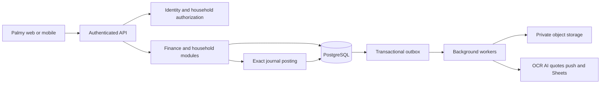

# Palmy — API design

Proposed v1 contract, derived from the audited UI. This is **not** a captured Seruma API. [openapi.json](openapi.json) contains typed request/response schemas and [api-catalog.md](api-catalog.md) lists every operation. The API contains no endpoints for the three excluded product areas.

## Architecture and boundaries

Use a modular service with one PostgreSQL transactional boundary for household writes. Modules own their rules; they share a journal-posting service and an outbox. Background workers handle receipt recognition, AI parsing, import validation, exports, reminders and provider callbacks. Object storage holds private files. An identity provider owns passwords and login recovery.



Use relative deployment base `/api/v1`; a Palmy hostname has not been provisioned. Bearer tokens represent an authenticated identity, never a household selected by the client alone. The API verifies issuer/audience/expiry, obtains the user from the subject, authorizes active membership for `{household_id}`, then sets transaction-local database context. Owner-only operations include membership, invitations, household settings, integrations and destructive lifecycle actions. Affiliate records belong to the current user even inside a shared household.

The client cannot choose `created_by`, ledger account IDs, final balances, cost basis, commission eligibility, job completion state or verification outcomes. Database rows are mapped to explicit API models. Internal ledger posting rows, secret references and provider tokens are not public resources.

## Conventions

| Area | Decision |
|---|---|
| Naming | Plural kebab-case resource paths; consistent snake_case properties/path variables. Naming is intentional even where the review skill prefers camelCase. |
| IDs | Server-generated UUIDs; an inaccessible UUID returns 404 without disclosing another tenant. |
| Money | Exact IDR decimal strings, up to 16 integer and 2 fractional digits; monetary commands require positive principal/amount, fees may be 0. Signed balances are a separate type. |
| Quantity and rates | Exact decimal strings; quantity up to 10 decimal places; timestamps and quote conversion provenance retained. |
| Dates | `YYYY-MM-DD` for date-only records; RFC3339 timestamps for instants; explicit household IANA timezone. Date and optional local time are not silently converted into UTC midnight. |
| Lists | `{data, next_cursor}`; default 25/max 100; opaque cursor bound to filters and stable tie-breaker ID. |
| Sorting | Date/amount plus ID tie-breaker. Filters execute before pagination. |
| Concurrency | Single-resource GET returns quoted version ETag; PATCH/DELETE and correction commands require `If-Match`; absent 428, mismatch 412. |
| Idempotency | POST requires `Idempotency-Key`, scoped to user, tenant and route. Same body replays response; different body returns 409. Keep response at least 24h; permanent domain uniqueness prevents later double effects. |
| Errors | `application/problem+json` with machine code, localized title/detail, field errors and request_id. No raw SQL/provider exception in UI. |
| Async |202 returns a Job. Poll `/jobs/{job_id}`; queued/running/review/succeeded/failed/cancelled states. Download URLs are short-lived and tenant-authorized. |
| Archival | PATCH `archived:true`; financial history remains. Posted financial corrections use reversals, not destructive row updates. |
| Security-sensitive work | Scope-bound step-up grant after PIN or identity reauthentication;5-minute expiry; PIN lock 15 minutes after 5 failures. This is a proposed policy, not an observed Seruma guarantee. |

Reject excess decimal precision instead of rounding an accepted request unexpectedly. Do not accept NaN, Infinity, scientific notation, negative expense values, malformed dates or client-supplied unknown fields. Locale-specific input is normalized by the client before submission. Return a new quote when a display conversion rate changes; changing display currency never rewrites base entries.

## Core command behavior

| Command | Preconditions | Atomic writes and outcome |
|---|---|---|
| Create wallet | Valid type and opening state; credit requires limit | Account + wallet + balanced opening journal; no direct balance column |
| Income/expense | Accessible wallet and category; amount positive; allocations sum exactly | Journal header/lines + allocation rows + audit/outbox; calculated split returned |
| Transfer | Different source/destination; eligible wallets; fee category if fee>0 | Source−(principal+fee), destination+principal, fee expense; one operation identity |
| Credit payment | Target credit wallet, source cash wallet | Cash decreases and credit liability decreases; fee separate; explicitly represent CR |
| Debt origin/payment | Direction/origin known; debt locked; payment≤remaining | Domain principal rows plus journal; interest and fee distinct; archive preserves totals |
| Goal movement | Goal/wallet locked; valid contribution mode; free cash sufficient for reserve | Reservation rows; journal only for new money or actual movement; no duplicate wealth |
| Asset trade | Holding locked; quote currency conversion specified; quantity available | Trade/basis journal; remaining quantity and cost recalculated; sale may not oversell |
| Grocery checkout | Selected items still active; expected total matches server | Immutable purchase lines + optional expense + item state; wallet required unless record-only |
| Service record | Equipment accessible; wallet selected unless record-only | Service + optional expense + next due/calendar update |
| Recurring occurrence | Due date and template valid; unique template/date | Reviewed command plus occurrence link; repeat returns existing or 409 |
| Import commit | Clean file, fresh preview hash, selected rows valid | All selected domain records + journals + fingerprints, or rollback everything |
| Allocation apply | Income plan totals 10000 bps; fresh preview and version | Period budget limits updated together; no asset trades executed |
| Payout request | Own verified destination; eligible balance and minimum | Reserve commission amount + payout request + provider outbox; callback deduplication |

Financial command services acquire resource locks in deterministic UUID order, re-read constraints while locked and commit the idempotency response with the operation. A provider request never runs inside the database transaction. Use an outbox and provider idempotency key so a worker crash cannot duplicate an external effect.

```mermaid
sequenceDiagram
    participant C as Client
    participant A as API
    participant D as Database
    participant W as Worker
    C->>A: POST transfer with idempotency key
    A->>A: Authenticate and authorize both wallets
    A->>D: Begin and claim key; lock wallets in ID order
    A->>D: Validate; insert balanced journal, audit and outbox
    A->>D: Save response; commit
    A-->>C: 201 transaction and Location
    W->>D: Claim undelivered outbox event
    W->>W: Deliver deduplicated notification
    C->>A: Retry identical key and request
    A-->>C: Replay original result
```

## Example: exact shared expense

```http
POST /api/v1/households/11111111-1111-4111-8111-111111111111/transactions
Authorization: Bearer <access-token>
Idempotency-Key: b63ae9df-58a6-4c7c-a364-47f8cfdd7db6
Content-Type: application/json
```

```json
{
  "kind": "expense",
  "wallet_id": "22222222-2222-4222-8222-222222222222",
  "amount": "1234.56",
  "effective_on": "2026-09-26",
  "description": "Synthetic household expense",
  "allocations": [
    {"category_id": "33333333-3333-4333-8333-333333333333", "amount": "1234.56"}
  ],
  "person_shares": [
    {"member_id": "44444444-4444-4444-8444-444444444444", "basis_points": 5000},
    {"member_id": "55555555-5555-4555-8555-555555555555", "basis_points": 5000}
  ],
  "source": "manual"
}
```

The server returns two analysis allocations of 617.28 each, one logical transaction and balanced postings totaling 1234.56 on each side. UUIDs above are illustrative synthetic IDs, not live account identifiers. The access-token marker is explanatory syntax, not a supplied credential.

For a debt overpayment, return 422 with `code: PAYMENT_EXCEEDS_REMAINING`, an Indonesian message such as `Jumlah melebihi sisa utang`, and `errors[0].field: principal`. The response may include current remaining amount through a fresh Debt response after refetch; do not embed private records from another tenant.

## Files, AI and imports

The file lifecycle is create upload URL → upload exact object → confirm → scan → clean/rejected. Maximum 20 MiB per file is a proposed Palmy limit. Allowed formats are JPEG, PNG, WebP, XLSX, CSV and ICS, with purpose-specific validation. MIME and file signature must agree; spreadsheet formulas are never executed by the import service. Export writers neutralize formula-like user text. Private downloads expire and must not contain long-lived calendar/OAuth secrets.

OCR and text parsing return review drafts only. A transfer proof may describe an internal transfer, expense or incoming payment; uncertain classification is shown explicitly. The client confirms wallet, amount, date, category and direction before invoking a financial command. Batch receipt requests contain 1–10 files; a job reports failures per file without dropping them silently.

Import validation resolves names to authorized IDs, reports row/field codes, flags duplicates and returns a preview hash that includes file hash, mapping, data and template version. A commit request names selected rows and the preview hash. Transactions use normalized command schemas; other domains use their own create schemas and validations. Keep original upload only for the approved retention window; normalized committed records become the source of truth.

Exports support seven observed in-scope domains. Export jobs include schema version, base currency, reporting timezone, applied period and display conversion metadata. A report's print view is client rendering of the same report payload. Template metadata and downloadable file URLs are returned as export-job results; no client should construct object-storage paths.

## Calendar, calculations and reporting

Calendar response expansion is bounded by the requested window. Clamp a monthly day beyond the month length to the month's last day. Store recurrence exceptions by original occurrence date. A recurring task completion requires `occurrence_on`; a one-off task may omit it. A feed grants read-only calendar access through a hashed token, and revocation takes effect before another response is generated. Do not place finance descriptions into a feed by default.

Calculators are deterministic and versioned. Education cost uses current cost×(1+inflation)^years. The annuity loan formula has an explicit zero-rate branch. Tiered rates re-amortize remaining principal over remaining term at each stage; extra payments reduce principal at the documented point in the schedule. Takeover compares old remaining payments against new payments plus penalty and fees. Round installment displays to two decimals and settle any residual in the final installment. Store input and computed result together when saving a scenario. These formulas must be independently tested before release.

Reports classify journal purposes, not just signed wallet changes. Cashflow distinguishes ordinary income/spending, principal, asset activity and fees. Net worth combines eligible cash/external balances, receivables and market-valued holdings less liabilities. Goal labels never add another asset. A linked asset is counted once even when it contributes to goal progress. Use conversion-rate provenance and stale-quote flags; approximate historical insight must not be labeled an exact investment return.

## Authorization and service responsibilities

The database schema supplies tenant fencing, composite foreign keys and selected invariant triggers. API role enforcement, provider verification, full command mapping and operational workers still require implementation. Identity bootstrap, PIN verifiers, calendar-feed secrets, OAuth tokens and payout destinations use separate restricted services. The normal API role cannot read these tables directly under the documented grants.

Global feedback is served through a narrow projection of public post fields and aggregate vote counts; it must never expose household_id, membership or finance data. Feedback author updates/moderation and commission eligibility are server/operator rules. Help publishes only approved versions. Public legal-link metadata is not a substitute for approved legal documents.

## Compatibility and verification

Additive optional fields are compatible within v1. New required fields, changed amount semantics, expanded security scope and removed enum values require a versioned change and migration plan. Clients should handle unknown response enum values gracefully while requests remain strictly validated. Publish contract diffs and changelogs.

The contract follows [OpenAPI 3.0.3](https://spec.openapis.org/oas/v3.0.3.html). Validation actually performed and environmental limits are recorded in [validation.md](validation.md). A lint-clean contract is not evidence that its endpoints exist or that server behavior passes the test matrix.
