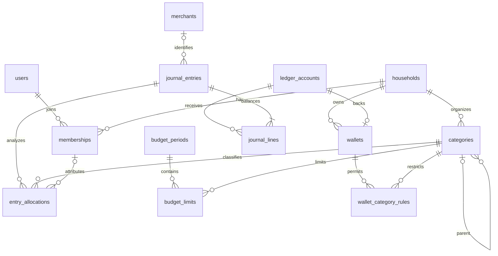
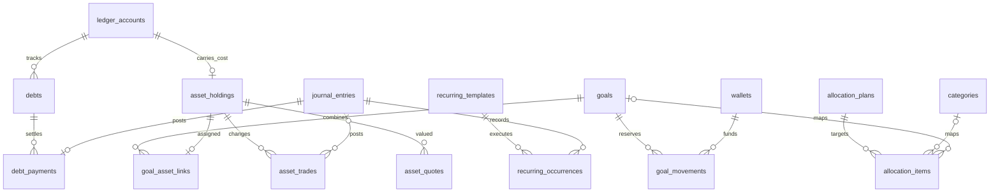
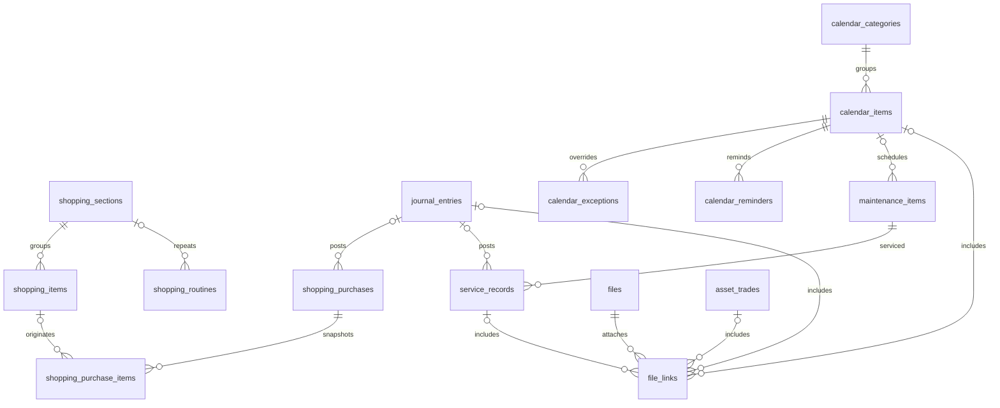
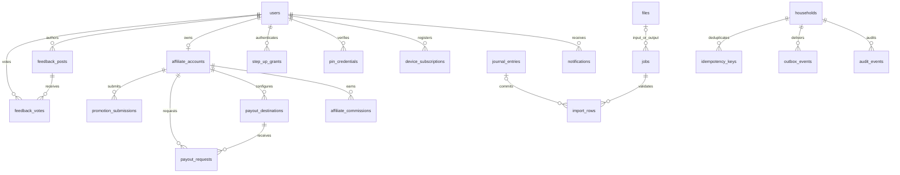

# Palmy — entity relationship diagrams

Proposed model; all in-scope household domains are represented. Each tenant child uses a composite `(household_id, referenced_id)` foreign key. IDs and optionality are fully specified in [schema.sql](schema.sql) and [database-dictionary.md](database-dictionary.md).

The complete 62-table diagram is [palmy-erd.mmd](palmy-erd.mmd). These smaller views omit repeated tenant and audit links for readability. They do not imply a different schema.

## Household and finance

A posted journal requires at least two lines; the diagram's one-or-more relationship is tightened by the balance trigger. Wallets map one-to-one to accounts by a unique constraint. Category hierarchy is limited to one child level.

## Debt, goals and investments

Cash reservations are labels over wallet money. A goal's linked holding contributes market value to progress without another household asset. An asset trade may omit a journal for a unit correction; purchased/sold money-bearing trades require one through the command service.

## Shopping, calendar and maintenance

Each file link points to exactly one typed domain resource. Service and purchase record-only mode has no journal; a recorded cost has a linked journal. A purchase needs at least one line through the checkout service even though a header can exist transiently within its transaction.

## Platform and affiliate

Notifications, affiliate records and security grants are additionally user-scoped. Public feedback reads use a narrow projection; tenant data does not become public merely because a post is public. Help articles are global versioned content. Calendar-feed and OAuth credentials remain private and are omitted from export models.
