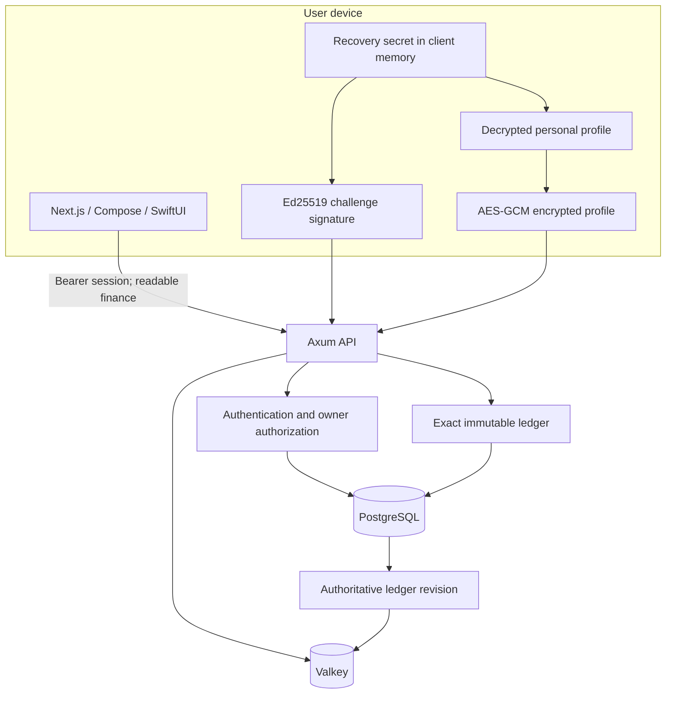

# Palmy monorepo architecture

Decision date: 27 September 2026. Inputs: every file in [`ai-analyze`](../ai-analyze/README.md), plus the user's requirement for root API/web/native folders and client-encrypted identity. The supplied files describe a product, not an existing backend. The source package remains unchanged for provenance.

## Repository and technology decisions

```text
/api                 Rust modular API, migrations, money and authorization rules
/web                 Next.js static export; authenticated UI renders on the client
/mobile/android      Kotlin + Jetpack Compose native Android app
/mobile/ios          Swift + SwiftUI native iOS app and testable crypto core
/contracts           Running API OpenAPI and shared cryptographic vectors
/design              Shared visual tokens and interaction rules
/docs                Architecture, threat model, protocol and delivery scope
/ops                 Local database bootstrap and API container
/scripts             Reproducible setup, integration checks and fixture generation
/ai-analyze          Original product/API/database design and reference audit
```

| Concern | Choice | Reason / constraint |
|---|---|---|
| Rust | 1.98.1, edition 2024, exact toolchain and Cargo lock | Latest stable verified from the [official release notes](https://doc.rust-lang.org/releases.html) on the decision date. |
| HTTP | Axum 0.8.9, Tokio, Tower | Maintained within the Tokio organization, composable middleware, async I/O. Its [official documentation](https://docs.rs/axum/latest/axum/) describes native Tower/Hyper integration. This is a performance-oriented choice; there is no defensible universal fastest framework. |
| Persistence | PostgreSQL 18.6, SQLx migrations | Exact numerics, transactional postings, constraints and row security. [18.6 release](https://www.postgresql.org/about/news/postgresql-186-1711-1615-1519-1424-and-19-beta-3-released-3365/). |
| Cache | Valkey 9.1.2, Redis protocol | Open-source shared cache and bounded authentication rate limits; [current stable release](https://valkey.io/download/). Cache is never the authority for access or balances. |
| API standard | Generated OpenAPI 3.1 | Runtime contract exported from the API; reviewed changes and drift check. Original 3.0.3 product contract remains a future design. |
| Web | Next.js 16.3.6 / React, TypeScript | Static deployment plus client data fetching and local cryptography. Next.js [static export](https://nextjs.org/docs/app/guides/static-exports) supports this deployment. No Next.js API routes or server-side profile processing. |
| Android | Kotlin, Jetpack Compose | Platform-native navigation, cryptography and future secure storage. |
| iOS | Swift, SwiftUI, CryptoKit | Platform-native rendering and cryptography. No Flutter or cross-platform UI runtime. |

Exact platform/dependency versions live in lockfiles and project manifests. Recheck releases before future upgrades; the word “latest” is not a floating dependency.

## Runtime boundaries



The API is a modular monolith. A single database transaction owns each financial command; avoid splitting the ledger into independently committing services. Transport validates bounded typed input; authentication derives the account from a verified session; domain code validates money; SQL repositories enforce owner predicates and transaction-local RLS. Clients never supply a trusted owner, balance, journal account, commission or completed job state.

Authentication verifies possession of an Ed25519 key derived from a random recovery secret. No email/provider subject is used for sign-in. The backend stores the public key, a random account UUID, challenge/session metadata and an encrypted profile envelope. Account creation IDs are client-generated UUIDs because the profile AAD must bind to the account before registration; financial IDs are server-generated.

Finance references pseudonymous owner UUIDs. They remain linkable to each other for ownership and reporting. Server operators can read finance and its pseudonymous grouping; they cannot decrypt profile fields from the database alone. This is **pseudonymity**, with limits detailed in [security.md](security.md).

## Data model and consistency

Separate authentication records, encrypted profile records and financial records. Do not deploy `ai-analyze/schema.sql` wholesale: its plaintext identity and provider mapping violate the new requirement. Runtime migrations are authoritative only for implemented features.

Each wallet starts at zero. Income/expense creates a journal and a pair of equal, opposite postings. Balance is derived from ledger lines, never accepted as a client field. Posted entries are immutable. All owner foreign keys include the owner, and the runtime role is neither superuser nor table owner and cannot bypass RLS. Authenticated database transactions set their owner locally, avoiding pooled-connection leakage. RLS protects application access; a database administrator can still inspect readable finance.

Monetary commands use exact strings with up to 16 integer and two fractional digits. Convert to checked integer minor units, not floating point. PostgreSQL uses `NUMERIC(18,2)` at storage boundaries. Preserve `1234.56` exactly. This intentionally follows the source's accepted two-decimal IDR model instead of silently adopting whole-rupiah rounding. Future sharing must implement deterministic largest-remainder allocation, including uneven cents.

Idempotency keys are scoped to account and operation and recorded in the same transaction as the result. Same key/body replays the result; changed body is a conflict. Immutable domain constraints will additionally protect scheduled and imported operations when implemented. Profile updates use a monotonically increasing version and reject stale writes.

## Cache design

Authenticate against PostgreSQL before any private cache read. Summary cache keys include protocol version, owner UUID and the owner's current ledger revision, which changes atomically with financial writes. Reading revision and authoritative totals consistently prevents post-commit stale cache races. Old revisions expire and cannot become current again. TTL bounds memory; it is not an authorization or consistency mechanism.

Do not cache decrypted profiles, recovery secrets, session tokens, positive authorization or provider credentials. Profile and finance HTTP responses use `no-store`; local web data exists in memory. Cache outages may degrade finance reads to PostgreSQL, while challenge rate limiting fails closed. Readiness reports failed dependencies. Valkey eviction policy is `noeviction` so memory pressure cannot silently discard rate-limit counters.

## Full product module design

| Module | Source requirements | Owns / integration boundary |
|---|---|---|
| Identity and household | FR-20, FR-21 | Encrypted personal profile, account keys, sessions; future pseudonymous membership, invitations, key distribution and revocation. |
| Ledger and wallets | FR-03–06 | Wallet accounts, immutable journals, expense/income, later transfers/credit repayment, exact allocations, history and corrections. |
| Planning | FR-08–10, FR-12 | Categories, budgets, debts/receivables, goal reservations, allocation plans; commands share ledger transaction. |
| Investments | FR-11 | Holdings, lots, trades, price provenance, fees and cost basis; goal links cannot double-count wealth. |
| Reports | FR-02, FR-14 | Period read models, cashflow/wealth distinctions, wallet/member filters, same totals for UI/print/export. |
| Capture and imports | FR-07, FR-22 | Scan file, parse to draft, user review, exact commit; private storage, jobs and deduplicated transactional outbox. |
| Scheduling | FR-13, FR-17 | Reviewed recurring templates, calendar/tasks, occurrence exceptions, reminder jobs, timezone policy. |
| Household operations | FR-16, FR-18, FR-19 | Groceries, maintenance and safe links; explicit wallet or record-only choice before linked postings. |
| Calculators | FR-15 | Versioned assumptions, deterministic formulas, zero-rate branch and final-installment remainder. |
| Ecosystem | FR-23, FR-24 | Separate affiliate/operator permissions, help and feedback; external payouts introduce identity disclosure. |
| Navigation | FR-01 | Home/Finance/Calendar/More product hierarchy, search with clear scope, accessibility and draft safety. |

Future workers take jobs from a PostgreSQL transactional outbox and never call providers inside ledger transactions. File uploads require MIME/size/scanning; signed downloads require current authorization. OCR/AI returns drafts and needs explicit disclosure of readable content; it must not receive decrypted profile automatically. No worker/provider integration is represented as already implemented.

Household sharing requires an explicit new protocol: per-person encrypted identity, verified recipient keys for any shared personal fields, pseudonymous membership and immediate authorization revocation. Membership must not automatically reveal private profiles. Financial sharing can remain readable server-side. That extension must ship with two-user tests and a defined recovery/rotation policy.

## Delivery and performance gates

The source targets p95 reads under 500 ms and writes under one second, excluding external providers. These are targets, not measured claims. Benchmark release builds with declared PostgreSQL data size, query plans, network path, cache hit ratio and concurrency. Compare Axum alternatives only on equivalent workloads if HTTP overhead is material. Database locks, indexing and report design are likely more consequential than empty-route throughput; measure before changing frameworks.

Production deployment needs TLS, secret injection, connection limits, gateway request limits, tested backup/restore and monitoring without personal data. The local Compose stack binds published ports to loopback and preserves other projects. See [delivery.md](delivery.md) for implementation status and [validation.md](validation.md) for actual checks.
