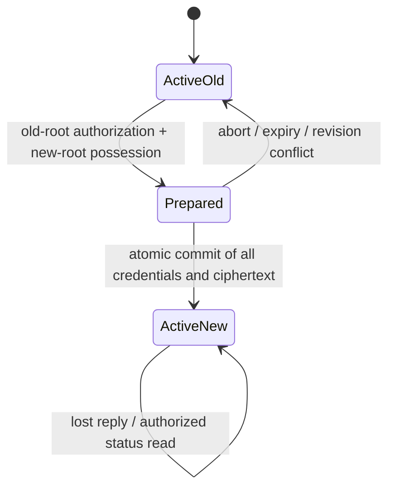

# Credential lifecycle proposal — MAN-115

**Status: reviewable protocol design, not implemented endpoints.** This proposal is `palmy-lifecycle/2-draft1`. The running [v1 protocol](protocol.md), Rust routes, migrations and generated OpenAPI remain unchanged. Deploying this design requires the implementation and review gates below. It is not a claim of professionally reviewed cryptography.

The current client derives both an account signing seed and a profile encryption key from one recovery secret. Every client importing that secret consequently holds the same full account authority. Current sessions can be revoked individually, but there are no device credentials, account-wide revocation fences, key replacement, or rotation transactions. This proposal separates those responsibilities without sending a recovery secret, private key or decrypted identity to Palmy.

## Security decisions and boundaries

1. A recovery credential authorizes account control; an enrolled device has independent keys and an explicit subset of permissions. Copying a normal device credential must not copy root recovery authority.
2. A bearer token alone cannot enroll devices, change credentials or revoke other devices. Those actions require a fresh, intent-bound signature from a currently authorized device or the current root.
3. Root rotation replaces the root keys, profile key and initiating device keys in one PostgreSQL commit. All previous devices and sessions are revoked. Keeping old devices during a root-compromise rotation is deliberately excluded; re-enroll them through verified pairing.
4. Device revocation blocks future server access. It cannot erase plaintext, financial exports, profile keys or ciphertext already copied by that device. Rotate the profile key before publishing further profile changes.
5. There is no email reset, server escrow or administrator bypass. If the recovery secret is lost, ordinary devices cannot replace it. They can keep using their granted functions while their keys remain available. If the root and all authorized devices are lost, the account is inaccessible. This is a deliberate recovery boundary, not an unspecified future fallback.

Readable finance, network metadata and stable account grouping retain the [existing pseudonymity limits](security.md). This design does not resist a malicious web bundle that steals keys on entry, a compromised unlocked device, or a malicious database administrator serving historical/forked state. Locally pinned revisions can detect some rollbacks; a fresh recovery client cannot prove global freshness without an additional transparency or trusted checkpoint system.

## Credentials, keys and permissions

| Material | Generation and use | Location |
|---|---|---|
| Root recovery secret `R` | Independent random 32 bytes. Recovery text: `palmy2.<lowercase UUIDv4>.<canonical decimal root_generation>.<unpadded base64url R>`. Never reuse a v1 secret as a v2 secret. | User-controlled recovery export; temporarily in client memory during recovery/rotation. |
| Root signing key | HKDF-SHA256 of `R`, salt UTF-8 `palmy:v2`, info UTF-8 `palmy:root-signing:v2`, length 32; result is an Ed25519 seed. | Client only; server stores raw 32-byte public key. |
| Root recipient key | HKDF-SHA256 of `R`, same salt, info `palmy:root-recipient:v2`, length 32; use the result as `ikm` to the selected HPKE KEM's **DeriveKeyPair**. Do not substitute raw X25519 scalar construction for that API. | Client only; server stores public recipient key. |
| Device signing key | Fresh independent Ed25519 key pair generated on that device. Do not derive it from `R`, copy another device's key, or convert an encryption key into it. | Memory; optional platform secure storage only after its separate review. |
| Device recipient key | Fresh independent HPKE X25519 recipient key pair. | Same device boundary; public key appears in its verified certificate. |
| Profile key `P[g]` | Fresh random 32-byte AES key for each profile-key generation `g`; independent of every root and device signing key. | Authorized clients; stored on the server only in recipient-specific HPKE envelopes. |
| Access token | Fresh random 32 bytes, opaque; maximum one-hour lifetime; digest stored on server. Bound to one device, its credential revision and the account session epoch. | Client memory; no positive authorization cache. |

HKDF provides purpose-separated derivation; Ed25519 uses the ordinary Ed25519 variant, not Ed25519ph or Ed25519ctx. Use maintained platform/library implementations, strict signature validation and shared vectors. [RFC 5869](https://www.rfc-editor.org/rfc/rfc5869.html), [RFC 8032](https://www.rfc-editor.org/rfc/rfc8032.html).

Supported device scopes are exactly `finance:read`, `finance:write`, `profile:read`, `profile:write`, `device:enroll`, `device:revoke`, and `session:revoke_all`. Scope arrays are sorted, unique and reject unknown values. `finance:write` requires `finance:read`; `profile:write` requires `profile:read`. Device scopes are immutable: a scope change creates a replacement credential with fresh keys and revokes the old credential.

The normal device preset is the four finance/profile scopes. A controller additionally receives the three management scopes, by **root authorization only**. A controller may enroll ordinary devices with finance/profile scopes that are subsets of its own; it cannot delegate a management scope. Root authority is not a device scope and is never returned in a bearer token. A finance-only device receives no profile-key envelope. Maximum active devices: 20 per account, enforced under the account lock.

Device IDs and labels must not disclose identity. Use random UUIDv4 IDs and generic client-local names. Do not add server-side email, biometric, hardware serial, advertising ID, push token or plaintext custom device-name columns as part of enrollment.

## Exact encoding and cryptographic context

All v2 lifecycle objects reject unknown fields and duplicate JSON member names. IDs use lowercase canonical UUIDv4. Binary values use canonical unpadded base64url; public keys are 32 bytes, signatures 64 bytes. Counters are **decimal strings**, no sign or leading zero, bounded to PostgreSQL signed BIGINT (`1` through `9223372036854775807`; reject overflow). This avoids JavaScript integer precision differences. Timestamps in proofs use UTC `YYYY-MM-DDTHH:mm:ssZ` with whole seconds. Server time decides expiry.

`JCS(x)` means RFC 8785 canonical JSON encoded as UTF-8. Protocol property names are fixed ASCII; a wire object contains only strings, booleans, null, arrays and objects—no JSON number values. Canonicalization does not normalize Unicode. Sets are sorted before canonicalization: scopes lexicographically, recipients by `(recipient_kind, recipient_id)`, device rosters by UUID. Production must use a reviewed JCS implementation and strict parser, not a casual property-sort function. [RFC 8785](https://www.rfc-editor.org/rfc/rfc8785.html).

Define `H(x) = SHA-256(x)` and `B64(x) = unpadded base64url(x)`. An intent proof signs exactly:

```text
UTF8("palmy:lifecycle:v2\0" + purpose + "\0") || H(JCS(proof_payload))
```

`purpose` is one of `snapshot`, `device_auth`, `enrollment_prepare`, `enrollment_ack`, `enrollment_activate`, `device_revoke`, `session_revoke_all`, `profile_rekey`, `rotation_prepare`, `rotation_authorize`, `rotation_accept`, `operation_status`, `operation_abort`, `migration_authorize`, or `migration_accept`. No dynamically chosen prefix is accepted. Device approval certificates use the separate `device_certificate` transcript below; they are not interactive authorization proofs.

The exact `proof_payload` fields are `protocol` (`"2"`), `account_id`, `actor_kind` (`root` or `device`), `actor_id` (`root` or device UUID), `operation_id`, `challenge_id`, `nonce` (random 32 bytes), `expires_at`, `credential_revision`, `profile_revision`, `session_epoch`, and `payload_hash` (`B64(H(JCS(operation_payload)))`). All fields are signed. Challenges are one use, expire after 120 seconds and are persisted in PostgreSQL. A challenge is scoped to the exact purpose, actor, operation and payload hash; the client checks these against its own pending action before signing. Never sign arbitrary server text.

Invalid proofs consume their challenge as in v1. Consuming a challenge must not depend on a later business transaction succeeding. Verification and final mutation still recheck current actor authorization and all bound revisions under the account lock; a consumed, previously verified proof is not transferable authorization. Retries after validation/conflict require a fresh challenge; successful idempotent replay returns a non-secret receipt after fresh status authorization.

### Profile and recipient envelopes

A v2 profile envelope has exactly `version` (`"2"`), `algorithm` (`A256GCM`), `key_generation`, `profile_revision`, `nonce`, and `ciphertext`. Its fresh nonce is 12 random bytes, its tag is 16 bytes appended to ciphertext, and its AAD is:

```text
JCS({"account_id": A, "key_generation": G,
     "profile_revision": V, "purpose": "palmy:profile:v2"})
```

Profile plaintext remains UTF-8 JSON `{display_name, email}`. A normal profile update keeps `G`, increments `V`, uses a new nonce and requires `profile:write`, exact expected revision and the current session/credential fence. It cannot change the recipient roster or root keys. Client-side self-decrypt and schema validation precede upload. Ciphertext is at most 8,192 decoded bytes. The API can enforce shape and authorization; it cannot prove that a client encrypted the intended plaintext or used a fresh secret.

Key distribution uses RFC 9180 HPKE **Base mode**, suite KEM `0x0020` (DHKEM(X25519, HKDF-SHA256)), KDF `0x0001` (HKDF-SHA256), AEAD `0x0002` (AES-256-GCM). A fresh encapsulation is required per recipient. The envelope is `{version:"2", suite:"0020-0001-0002", account_id, root_generation, operation_id, recipient_kind, recipient_id, recipient_public_key, key_generation, enc, ciphertext}`. Its encrypted plaintext is JCS `{account_id, key_generation, profile_key:B64(P[g])}`. Its `info` is JCS `{purpose:"palmy:profile-key:v2", account_id, root_generation, key_generation, recipient_kind, recipient_id, recipient_public_key, operation_id}`; use empty `aad` for the single-shot API. The signed lifecycle payload includes every envelope, including `enc`, `ciphertext` and provenance fields. Reject an unknown suite, all-zero DH result or malformed recipient key. Base mode alone does not authenticate the sender: the verified root/device approval signature and trusted key comparison provide that binding. [RFC 9180, algorithms and application context](https://www.rfc-editor.org/rfc/rfc9180.html#section-7).

Persist and return each envelope's **original** `account_id`, `root_generation`, `operation_id`, recipient fields and generation verbatim in snapshots. Do not reconstruct `operation_id` from the latest enrollment or rotation: envelopes created by different enrollments within one profile generation have different provenance. Active envelopes must match the account's current root/profile generations; enrollment preserves existing envelopes and adds one with its own operation ID. A profile rekey replaces all envelopes using the same unchanged current root generation and the rekey operation ID. Root rotation replaces all envelopes using the **new** root generation and rotation operation ID. Archived envelopes retain their historical provenance and are never substituted for active envelopes; this draft exposes no historical-envelope download API.

Every profile generation has exactly one envelope for the current root and one for each active device with `profile:read`; no duplicate, missing, revoked or extra recipient is accepted. Root rotation is the exception only in that it atomically replaces the entire active roster with the new initiating device. HPKE does not provide forward secrecy against compromise of a long-term recipient private key; retained historical envelopes can still be decrypted if that key is later stolen. [RFC 9180, security properties](https://www.rfc-editor.org/rfc/rfc9180.html#section-9.7.4).

## Persistent state and transaction boundary

Proposed fields/tables extend the runtime schema; this document is not an SQL migration:

| State | Authoritative fields/invariants |
|---|---|
| `account_security` | Account ID, protocol version, root generation and both root public keys, `credential_revision`, `session_epoch`, profile generation/revision, state `active` or `rekey_required`. One row is the synchronization lock. |
| `device_credentials` | Composite `(account_id, device_id)`, independent signing/recipient public keys, immutable sorted scopes, root/sponsor approval certificate, credential revision, state `pending/active/revoked`. Revoked IDs/keys never reactivate. |
| `profile_key_envelopes` | Account, root/profile generations, immutable originating operation UUID, recipient kind/ID/public key, suite, encapsulation and ciphertext; composite owner constraints and exact recipient set. Snapshot returns these original fields so HPKE `info` is reproducible. No plaintext profile key. |
| `sessions` | Account, device, device credential revision, account session epoch, token digest, expiry/revoked status. Legacy sessions have an explicit protocol version. |
| `lifecycle_challenges` | Exact purpose/actor/operation/hash/counters, nonce, expiry and consumed status. |
| `lifecycle_operations` | Account-scoped operation UUID, immutable kind and payload hash, expected revisions, prepared key proofs, expiry, `prepared/committed/aborted/expired/conflicted`, and non-secret result receipt. |

Registration/upgrades and every lifecycle change acquire `account_security FOR UPDATE` first. Every protected read, write and device-session issuance obtains `account_security FOR SHARE`, then verifies the session and device **inside that transaction**. Acquire the finance owner lock second, and domain locks in UUID order. This replaces the current authenticate-before-domain-transaction pattern when lifecycle support ships; merely adding a new revocation table is insufficient.

Hold the shared lock until the protected DB operation or cache read is complete. Mutations commit their journal, idempotency response and authorization checks together. Authorization never comes from Valkey. Cache operations retain the bounded timeout and owner/ledger revision key; recheck authorization before a hit. Long exports/background jobs must reauthorize at execution and before delivery; they are not covered by a request's old token validation.

The revocation linearization point is the `FOR UPDATE` transaction commit. A write holding the shared lock first may commit before revocation; one arriving after revocation must fail its new fence check. Bytes already authorized and in flight may arrive after a revocation response; neither revocation nor key rotation retracts those bytes. No operation can commit a new financial mutation **after** a completed revocation using a stale epoch. Test these orderings with actual separate PostgreSQL connections, not only the reference model.

Do not let runtime roles bypass RLS or own tables. Lifecycle status/history endpoints return only owner-authorized projections; signature and operation metadata must not become an unauthenticated account-directory API. Rate limits apply globally and per account/actor/operation and fail closed where they protect proof issuance. Proposed maximum prepared operations: one root rotation and five enrollments per account, each expiring after ten minutes. Bound lifecycle request bodies to 64 KiB for at most 21 recipient envelopes; retain v1's 16 KiB limit elsewhere.

## Device sign-in and account-wide revocation

Device sign-in uses `device_auth` proof over an API-generated challenge bound to account, device credential revision and current epoch. Proof consumption, active-device/scope verification and session insert follow the account locking rule. Challenge responses for unknown devices/accounts have the same shape; never reveal existence through the challenge response. Tokens remain one-hour opaque values and cannot be upgraded by supplying a device ID or new scopes in headers.

`session_revoke_all` requires the root or an active device with `session:revoke_all` plus a fresh intent proof. Under `FOR UPDATE`, increment `session_epoch` and `credential_revision`, invalidate every old token, and invalidate pending challenges/enrollments/rotations bound to the old revision. Return 204 with no replacement token. Active, unrevoked devices can sign in again with a **new** challenge. The UI must distinguish this from removing devices.

To remove a device, the root or a controller with `device:revoke` submits a fresh proof. Immediate fencing marks the target revoked and increments epoch and credential revision. If it held `profile:read`, set the account to `rekey_required` in the same commit: block **all profile writes and new profile-capable enrollment** until a profile-rekey bundle commits. Existing devices may still read the already disclosed old profile; finance remains available to authorized devices. A controller with both profile read/write can instead submit the complete rekey bundle with revocation, making fencing, fresh `P[g+1]`, freshly encrypted profile, exact surviving-recipient envelopes and profile/credential revisions atomic. A finance-only target that has never held a profile key needs no profile rekey. Scope upgrades always use a new device ID, so the server can verify that history.

Profile rekey completion is a **single atomic** `profile_rekey` operation, distinct from dual-root rotation. It requires the current root, or an active controller with `device:revoke`, `profile:read` and `profile:write`. Its operation payload has exactly `{kind:"profile_rekey", protocol:"2", account_id, operation_id, expected:{root_generation, credential_revision, session_epoch, profile_generation, profile_revision}, profile, profile_key_envelopes}`. `profile` is the full new v2 envelope; `profile_key_envelopes` is the exact current-root plus surviving-profile-device set. It proposes profile generation and revision `+1`, retains both root public keys and root generation, and contains no device-scope/key replacement. Bind this payload hash to a fresh `profile_rekey` challenge/proof; a `rotation_authorize` proof cannot authorize it.

Under `FOR UPDATE`, recheck all expected fields, the actor's current scopes and recipient set, replace ciphertext/envelopes together, clear `rekey_required`, and increment credential revision and session epoch. There is no separately prepared record and no new-root proof for this operation. An atomic bundled revoke/rekey uses purpose `device_revoke` and adds `target_device_id` to this payload, excluding that target from recipients and marking it revoked in the same commit. A fence-only revoke uses exactly `{kind:"device_revoke", protocol:"2", account_id, operation_id, expected, target_device_id, rekey:null}`. The corresponding idempotency record commits with either operation; a lost reply uses the operation-bound status proof, never repeats a different payload under the same UUID.

If profile decryption is impossible, keep `rekey_required`; do not silently overwrite identity with an empty profile or resume writes using the compromised key. An independent identity-reset design would need explicit user consent and recovery semantics.

## Verified device enrollment

An approval certificate has exactly `{certificate_version:"2", account_id, root_generation, device_id, signing_public_key, recipient_public_key, scopes, issuer_kind, issuer_id, enrollment_operation_id, activated_credential_revision}`. Its `certificate_signature` is over `UTF8("palmy:lifecycle:v2\0device_certificate\0") || H(JCS(certificate))` under the issuer's signing key. A root issuer uses ID `root`; a controller issuer uses its device UUID and supplies its root-signed controller certificate. Root-only management delegation bounds certificate chains to root → controller → ordinary device. `activated_credential_revision` is the expected account credential revision plus one; activation fails if that expected revision changed. Certificates are immutable evidence of approval, **not** proof that a device is currently active: every request still checks the database fence. The certificate and signature are included in the signed enrollment/rotation proposal; a new rotation's first device certificate is signed by the new root.

1. The new device locally generates its two independent key pairs, a device UUID, enrollment UUID and random 32-byte enrollment nonce. It displays an **in-app** QR descriptor containing these public keys/IDs, nonce and requested ordinary scopes. It does not put recovery material, tokens or enrollment state in an HTTPS/deep-link URL. The descriptor is not an authorization credential.
2. An unlocked controller scans that device's screen through a trusted physical channel and explicitly approves the account and scopes. It checks its own pinned root and certificate chain. A server-delivered public key is never treated as verified merely because it belongs to the account. Remote enrollment requires comparing the full SHA-256 transcript fingerprint over an independent authenticated channel; short numeric codes and “approve latest request” are excluded from this draft.
3. The controller obtains an `enrollment_prepare` challenge and signs the complete payload: current account/root/revisions, exact new descriptor and granted scopes, certificate chain hashes, expiry, profile revision and optional new-device HPKE envelope. The new device also signs this payload with its own signing key to prove possession. The API validates the controller, subset policy and proof, then records a **pending** enrollment. Pending devices cannot authenticate or read account data.
4. The controller displays a reverse QR containing the account ID, both pinned root public keys/generation, approving device public key/certificate hash and full prepared payload hash. The new device scans it, compares the descriptor to its own locally generated keys, verifies the approval certificate chain against that out-of-band root anchor, and verifies the controller signature. A fingerprint only authenticates keys after this comparison; fetching both the fingerprint and key from the same server does not.
5. For `profile:read`, the new device decrypts its HPKE envelope, verifies account/generation, and decrypts the supplied current profile envelope. It returns an `enrollment_ack` signature over the prepared payload hash and a key-confirmation MAC. The MAC key is HKDF-SHA256 of `P[g]`, salt `palmy:v2`, info `palmy:enrollment-confirm:v2`, length 32. MAC input is the full signed prepared-payload hash plus the enrollment nonce, with domain prefix `palmy:enrollment-confirm:v2\0`. The controller verifies this MAC and the new-device signature locally. For a finance-only device, omit both the HPKE envelope and MAC; signed key possession still applies.
6. The controller submits a fresh `enrollment_activate` proof covering the prepared payload, acknowledgement and confirmation digest. Under `FOR UPDATE`, the API rechecks the controller is still active, scope subset, all prepared revisions, expiration, device cap, unique keys and unchanged profile generation/revision. It activates the new device, persists its certificate and envelope and increments credential revision. A server cannot verify the plaintext-key MAC itself; the controller's activation signature attests its successful local check. The new device signs a fresh auth challenge to get its own session. Aborted, expired or conflicted enrollments never grant access.

A root may act as approver through a root proof after decrypting the root envelope, including when no other device exists. This also permits root-authorized controller enrollment. The same two-party key comparison, possession checks and atomic activation apply. Recovery entered directly on the new device may perform both roles locally, but must show the final scopes and discard `R` after enrollment; retain only that device's keys and profile key.

## Root rotation and interrupted recovery

Rotation is a client-prepared, server-atomic replacement, not a series of “change public key” and “save profile” requests. The old root and the new root must both sign the same complete proposal under distinct proof purposes. A normal device, bearer token or operator cannot substitute for the old-root proof.



Preparation on the trusted client:

- Fetch an authenticated snapshot containing the current root public keys, profile/envelopes and revisions. Derive the old root public keys from the supplied recovery credential and require an exact match. Decrypt the old root envelope and profile.
- Generate an independent `R'`, fresh profile key `P[g+1]`, fresh initiating-device signing/recipient keys and a new operation UUID. Root generation, profile generation, profile revision, credential revision and session epoch all advance exactly once at commit.
- Encrypt the same locally reviewed profile under `P[g+1]`, wrap it only to the new root and new initiating device, and self-decrypt **both** envelopes and the profile. The new root proof must bind both its signing and recipient public keys, the entire ciphertext/envelope set, expected current versions and operation UUID. This is proof of private-key possession and local checking, not proof to the server that the profile plaintext was preserved.
- Export the new `palmy2` recovery credential and require explicit saved-key acknowledgement **before** submitting preparation. Keep the old credential until new-root recovery is independently verified after commit. Web never persists this journal/keys automatically; an explicit encrypted, user-saved recovery export is permitted. Native persistent rotation journals require separate secure-storage review. All deterministic keys/nonces in fixtures are public test data only.

Server preparation accepts fresh `rotation_prepare` proof from the old root and `rotation_accept` proof from the new root, records the immutable proposal hash and both verified public-key sets, and expires after ten minutes. It does not activate any new key, block ordinary finance, or modify the profile. A profile update/device change in the meantime is allowed and will make the proposal stale. Never reserve the account lock while waiting for a human to save a key.

The exact rotation `operation_payload` is `{kind:"root_rotation", protocol:"2", account_id, operation_id, expected:{root_generation, credential_revision, session_epoch, profile_generation, profile_revision}, next_root:{root_generation, signing_public_key, recipient_public_key}, first_device:{certificate, certificate_signature}, profile, profile_key_envelopes, saved_recovery_acknowledged:true}`. All ciphertext and recipient metadata are inside this canonical payload; the client cannot send unsigned replacement envelope fields alongside it. The first-device certificate is signed by `next_root` and proposes `activated_credential_revision = expected.credential_revision + 1`. `next_root.root_generation`, profile generation/revision and every recipient envelope must have the exact next values defined above. The saved-key acknowledgement is a required explicit client assertion, not server-verifiable evidence that the user made a backup. Migration uses the same payload shape with `kind:"credential_migration"`, `expected.protocol:"1"`, no expected v2 generations and initial next generations `"1"`.

Commit obtains a new one-use `rotation_authorize` challenge for the old root and a new `rotation_accept` challenge for the new root, both bound to the same prepared hash and current preconditions. Inside one `FOR UPDATE` transaction:

1. Recheck active old root, prepared state/expiry, both proofs, expected protocol/root/credential/session/profile revisions, exact new recipient set and device uniqueness.
2. Replace both root public keys and root generation; replace profile ciphertext, profile generation/revision and all live recipient envelopes; revoke every prior device and activate only the new initiating device.
3. Increment credential revision and session epoch; invalidate old challenges/prepared operations; mark this operation committed and store a receipt containing operation UUID, proposal hash and resulting revisions. Commit once.

An error at any step rolls back **every** change. Profile ciphertext under a new key must never coexist as the active profile with old signing authority or missing recovery envelopes. A newly activated device still performs fresh sign-in; the commit response contains no bearer token. Repeating the same commit after a lost reply cannot rotate twice: query status with fresh proof and compare the immutable proposal hash. A reused operation UUID with a changed proposal returns 409.

| Interruption/loss | Required behavior |
|---|---|
| Before preparation | Server unchanged. Old recovery works; discard/recreate an unsaved new candidate. |
| Prepared but not committed | Old root remains current. Abort/expiry leaves it current. New root can authenticate only to that proposal's bounded status endpoint, not account data. |
| Commit reply lost | Treat outcome as unknown. Query operation status with fresh proof under either key recorded in that proposal. Status returns only `prepared/committed/aborted/expired/conflicted`, proposal hash and resulting revision receipt, never profile, envelopes, devices or finance. The historical old-key exception is confined to this one receipt. |
| Status says committed | Use saved new credential to derive expected public keys, get a new authenticated snapshot, decrypt the current root envelope/profile and enroll/sign in with the new device. Only then erase the local old credential. |
| Server unavailable or status contradictory | Keep both credentials; do not retry as a different rotation, overwrite either credential, or claim success/failure. A current authenticated snapshot plus the exact new keys/revisions can resolve a pruned receipt. |
| New secret lost after commit, old secret retained | Old root cannot undo the commit. The new initiating device may retain ordinary/controller access but cannot replace the lost root. There is no rollback that reactivates compromised old credentials. |
| Old root already compromised | A valid rotation/revocation racing an attacker is serialized by the account lock. The first authorized commit wins. The server cannot distinguish the rightful person from another holder of the same root secret. |
| No root, but an active device survives | Keep that device's allowed access; export readable data/profile locally if permitted. It cannot replace root authority or manufacture a recovery key. |
| No root and no usable device | Irrecoverable account access. Do not fall back to email, support tickets or a database flag. |

Keep operation receipts for at least seven days in the first implementation, with a documented purge job. Expired challenges may be removed sooner. Never retain secrets or plaintext profile in operation/audit records. A receipt is evidence of the server's reported state over authenticated transport; it is not a transparency proof against that server.

## Migration from implemented v1

Accounts remain v1 until the owner explicitly upgrades with a current v1-root proof and self-verified v2 candidate. Use the rotation transaction, but `migration_authorize` verifies the current v1 Ed25519 key and v1 profile decrypts with the existing HKDF/AES context. `migration_accept` verifies the new v2 root. Root/profile generation start at `"1"`; the stored profile revision still increases from the existing revision. A fresh random v2 root is required; v1 and v2 derivation outputs are not interchangeable.

The atomic commit marks that account protocol v2, installs the v2 root/envelopes/device, removes legacy sign-in eligibility and invalidates **all** v1 sessions/challenges. Both v1 auth and all v1 protected endpoints must check the account's protocol state, including formerly issued tokens; updating only the challenge endpoint leaves a bypass. Old clients receive `409 CLIENT_UPGRADE_REQUIRED` only after proving account access, without an unauthenticated account-existence oracle. No dual-active v1/v2 authority window is allowed. Non-upgraded accounts retain their existing behavior until a separately approved migration policy changes it.

The database change must land before enabling v2 clients. Roll out additive schema and a disabled capability, verify migration/rollback on disposable databases, then enable per-account upgrade. Reverting application code must not turn protocol-v2 accounts back into v1 accounts or revive old keys. Retain old ciphertext in encrypted backups under the existing retention policy; rotation is not retroactive backup erasure.

## Proposed operations and error contract

These are proposed v2 operations, **absent from the running OpenAPI**. Final request/response schemas must be generated with the implementation; this list is a planning contract.

| Proposed path/method | Purpose and authorization |
|---|---|
| `POST /api/v2/auth/challenges`, `POST /api/v2/auth/sessions` | Device-bound challenge and one-hour session issuance. |
| `POST /api/v2/lifecycle/challenges` | Issue a bounded intent/payload-bound challenge; uniform unknown-actor shape. |
| `POST /api/v2/lifecycle/snapshot` | One-use root or scoped-device proof; current keys/revisions, authorized certificates and encrypted profile/key envelopes only. |
| `POST /api/v2/device-enrollments`, `POST /api/v2/device-enrollments/{id}/ack`, `POST /api/v2/device-enrollments/{id}/activate` | Pending proposal, new-device possession/key acknowledgement, existing approver's final activation. |
| `POST /api/v2/device-revocations` | Immediate device fence, with optional complete profile rekey bundle. |
| `POST /api/v2/profile-rekeys` | Complete `rekey_required` with current trusted recipient set and client-verified bundle. |
| `POST /api/v2/session-revocations` | Account-wide session fence; does not remove device credentials. |
| `POST /api/v2/root-rotations`, `POST /api/v2/root-rotations/{id}/commit` | Dual-proof immutable preparation and atomic replacement. |
| `POST /api/v2/credential-migrations`, `POST /api/v2/credential-migrations/{id}/commit` | Explicit v1-to-v2 owner upgrade using the rotation machinery. |
| `POST /api/v2/lifecycle/operations/{id}/status`, `POST /api/v2/lifecycle/operations/{id}/abort` | Fresh operation-bound proof; status-only historical-key exception as specified above. Abort only prepared operations. |

Return the existing RFC 9457 problem shape and `no-store`. Use `400 INVALID_REQUEST` for invalid encodings/shape, `401 INVALID_PROOF` for invalid/expired/consumed proof or stale session, `403 INSUFFICIENT_SCOPE` for a known authenticated actor lacking authority, `404 OPERATION_NOT_FOUND` after status-proof verification, `409 REVISION_CONFLICT`, `409 IDEMPOTENCY_CONFLICT`, `409 OPERATION_FINAL`, `409 PROFILE_REKEY_REQUIRED`, `409 DEVICE_LIMIT`, `410 OPERATION_EXPIRED`, `429 RATE_LIMITED`, and `503 DEPENDENCY_UNAVAILABLE`. Use 201 for preparation, 200 for committed/status receipts, and 204 for revocation/abort. Never include another device's personal label, input secrets, ciphertext dump or raw database error in a problem.

## Executable acceptance reference and implementation gates

Run `node scripts/lifecycle-check.mjs`. [`contracts/lifecycle-vectors.json`](../contracts/lifecycle-vectors.json) contains public deterministic transcript, signature and profile-AAD vectors; [`contracts/lifecycle-cases.json`](../contracts/lifecycle-cases.json) names the state-transition cases. `--write-vectors` deliberately regenerates public fixtures for review.

The script is an **in-memory reference model**, not an API, migration, HPKE implementation or formal verification. It checks intended serialization/cryptographic bindings with Node's standard Ed25519/HKDF/AES-GCM, staged atomic state replacement and explicit interleaving outcomes. Its recipient records represent authorization sets, not valid HPKE ciphertexts. It does not establish constant-time behavior, hardware-backed storage, network fault behavior, real database locking or cross-platform HPKE interoperability. Passing it cannot activate this design.

Required implementation acceptance:

- Cross-language exact vectors for proof serialization, Ed25519, AES profile AAD, **real HPKE** root/device envelopes and enrollment confirmation MAC; RFC HPKE test vectors first, then Palmy vectors. Negative cases include wrong account, purpose, root/profile generation, recipient, nonce, suite, key, tag and unknown/duplicate fields.
- Actual PostgreSQL two-connection tests for auth issuance versus revocation, finance write versus revocation, cached read versus revocation, concurrent enrollment versus sponsor revocation, profile edit versus rotation and two competing rotations. Verify table-owner/runtime RLS separation and pooled-context cleanup.
- Inject failure after every SQL mutation in rotation/migration and assert an entirely old or entirely new state, never a mixture. Repeat commit after a dropped response; verify one epoch/generation advance and no old-token/key bypass through v1 routes.
- Native/web orchestration tests for lock/background during enrollment/rotation; no late callback reactivates an account. Inject malformed profile, unavailable cache, lost replies, expired proposal, deleted status receipt and app termination. Saved-key acknowledgement and successful independent new-root recovery must precede old-key erasure.
- Verify scope combinations, controller non-delegation, finance-only absence of profile envelopes, revocation of the enrollment approver, profile-write fencing in `rekey_required`, 20-device/operation limits, and no secret/plaintext identity in requests, persistence, logs, crash reports, analytics or ordinary backups.

Implementation slices, each independently reviewable:

| Follow-up | Deliverable and completion boundary |
|---|---|
| Slice A — state and authorization fence | Add disabled v2 security/device/session schema and transaction-local authorization guard; real concurrency/RLS tests; no new client capability yet. |
| Slice B — verified device credentials | Review/select maintained HPKE/JCS libraries for all clients, add interoperable vectors and signed certificates, then implement enrollment, scope checks and device sign-in. |
| Slice C — revocation and profile rekey | Implement account-wide session fence, device revoke/`rekey_required`, exact recipient replacement and cache/job fence tests. |
| Slice D — rotation and migration | Add dual-proof prepare/commit/status state machine, immutable idempotency, v1 closure checks and failure injection; wire saved-key/recovery confirmation flows. |
| Slice E — release review | Independent implementation review, professional cryptographic protocol review, platform storage/distribution review and operational recovery exercise. Record reviewer findings and close blockers before enabling for real records. |

Independent peer implementation review and specialist cryptographic protocol review are separate gates. Professional cryptographic review remains unperformed and required before release: this proposal composes standard primitives but that does not by itself prove the resulting protocol secure. Key lifecycle, revocation guarantees, trusted enrollment UX and interrupted-rotation handling must be reviewed together.
